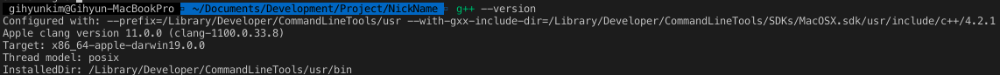

# NickName 생성기

## 개요

c++을 이용해 nick name(별명)을 생성할 것 입니다.

필요 리소스는 본인의 이름뿐 입니다.

예를 들어 "홍길동"의 이름을 넣으면

홍길동에서 추출할 수있는 알파벳을 추출합니다.

알파벳의 조합을 이용해 \<nick name\> 이 될 수 있는 경우의 수를 모두 보여줍니다.

사용자는 그 중에서 마음에 드는 닉네임을 고르면 됩니다.

## 알고리즘

\<nick name\>은 다음의 알고리즘을 따릅니다.

### 이름 입력

사용자의 이름을 unicode로 입력받고 저장합니다.

예를 들어 "홍길동"이라는 이름을 입력했다고 가정합니다.

"홍길동"을 unicode로 변환하면 0xD64D(홍) 0xAE38(길) 0xB3D9(동) 으로 변환됩니다.

### 알파벳 추출

추출된 uunicode를 이용해 알파벳을 추출 할 것입니다.

3글자의 unicode로 이루어진 이름을 1byte로 쪼개서 저장합니다.

0xD6 0x4D 0xAE 0x38 0xB3 0xD9

이름을 10진수 26으로 나눈 나머지에 97을 더합니다.

`alphabet[i] = ( alphabet[i] % 26 ) + 97`

D6 -> 6 + 97 = 103 = g

4D -> 25 + 97 = 122 = z

AE -> 18 + 97 = 115 = s

38 -> 4 + 97 = 101 = e

B3 -> 23 + 97 = 120 = x

D9 -> 9 + 97 = 106 = j

`alphabet = {g, z, s, e, x, j}`를 추출 했습니다.

### 조합

**모음: a e i o u y**

**자음: 모음외 나머지 알파벳**

1. 만약 모음이 한개도 없다면, 사용자가 원하는 모음 하나 선택할 수 있다.
2. 모음은 중복을 허용한다.
3. h를 제외하고는 자음뒤에는 항상 모음이어야 한다.( bh, ch등은 가능 그러나 hh는 불가능)
4. 모음은 모음뒤에 최대 1번까지 올 수 있다.(단어내에 ee, ii 등 존재가능) 그 이후에는 자음이 와야한다.(단어내에 eee, iii는 존재할 수 없다.)


## 소스코드

**개발환경**

1) OS: MacOS 10.15

2) Language: C++ 11

3) Compiler: g++ 4.2.1




```c++
#include <bits/stdc++.h>

using namespace std;

int main()
{
  return 0;
}
```


